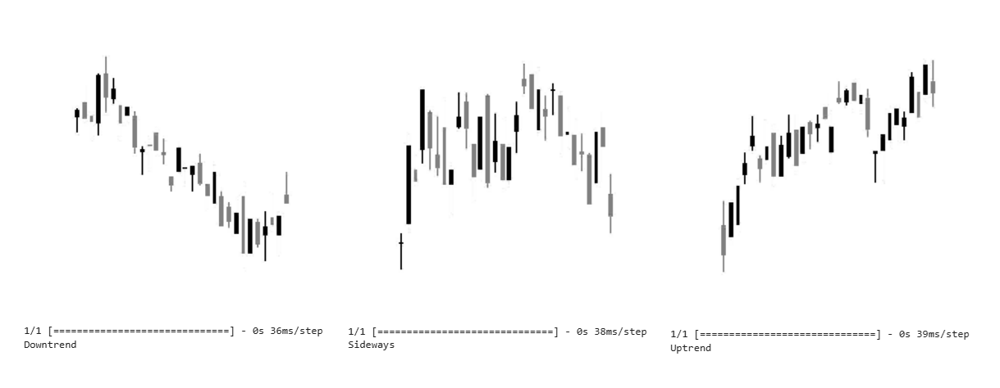

# Classifying stock price trends through CNN

  

## This repository contains a TensorFlow-based image classifier for classifying stock price chart images into three categories: uptrend, downtrend, and sideways.

### Here's a step-by-step guide to the notebook:

### 1.  Import Necessary Libraries:

- Import libraries for handling image processing, model building, and data manipulation:
  - TensorFlow
  - NumPy
  - Matplotlib
  - OpenCV (cv2)
  - Keras preprocessing layers
    
### 2.  Load and Preprocess Data:

- Create an ImageDataGenerator object to augment and normalize images:
  - Rescale pixel values to 0-1 for better training.
  - Split data into training (70%) and validation (30%) sets.
  - Load images from the "images/" directory, resizing them to 200x200 pixels.

### 3.  Define the Model Architecture:

- Create a Sequential model with the following layers:
  - Convolutional layers (Conv2D) with ReLU activation and MaxPooling2D for feature extraction.
  - BatchNormalization layers to improve training stability.
  - Flatten layer to convert 2D feature maps into a 1D vector.
  - Dense (fully connected) layers with ReLU activation for classification.
  - Dropout layers (0.2 rate) to prevent overfitting.
  - Final Dense layer with 3 units and softmax activation for class probabilities.
    
### 4.  Compile and Train the Model:

- Compile the model using:
  - Categorical crossentropy loss for multi-class classification.
  - RMSprop optimizer with a learning rate of 0.001.
  - Accuracy metric to track performance.
- Train the model on the training dataset using:
  - 100 epochs (iterations over the entire dataset).
  - 3 steps per epoch (number of batches per epoch).

### 5.  Evaluate and Make Predictions:

- Load images from the "test/" directory.
- Preprocess them (resize, normalize) as done with training images.
- Use the trained model to predict the class (uptrend, downtrend, or sideways).
- Display the prediction results alongside the test images.

### Key Points:

- The notebook demonstrates a practical application of image classification with convolutional neural networks.
- It covers essential steps like data preprocessing, model architecture design, training, evaluation, and prediction.
- The model can be further improved with hyperparameter tuning, data augmentation techniques, and exploring different model architectures.

### To run the notebook:

1. Ensure you have TensorFlow and other required libraries installed.
2. Download or clone this repository.
3. Open the notebook in a suitable environment (e.g., Jupyter Notebook).
4. Execute the code cells sequentially to train and test the model.

______________________________________________________________________________

## Data Acquisition Notebook:

The first notebook (get_images.ipynb) focuses on collecting and preprocessing stock price data to generate chart images for training the classifier. Here's a breakdown of the steps:

- Imports libraries for data manipulation, plotting, and image creation (pandas, yfinance, matplotlib, PIL).
- Downloads historical stock price data for a chosen symbol (e.g., "VALE3.SA") using yfinance.
- Creates a directory (imgs_example/) to store generated chart images.
- Iterates through the data in time windows of a specific size (e.g., 30 days).
- For each window, creates a candlestick chart using matplotlib:
- Plots open, close, high, and low prices for each day.
- Uses different colors to represent up and down days.
- Saves the generated chart image as a JPEG file with a unique name.
